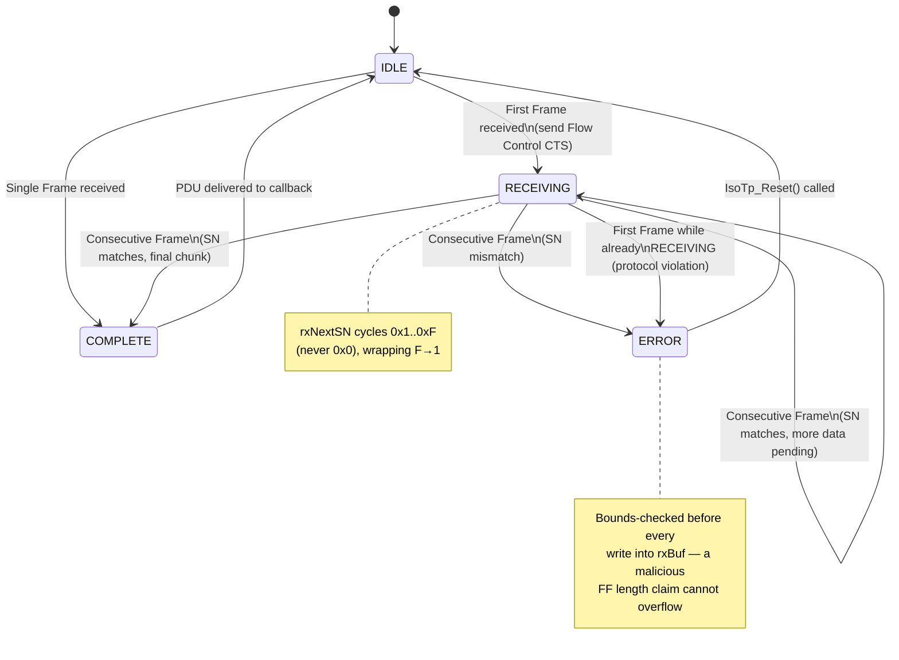
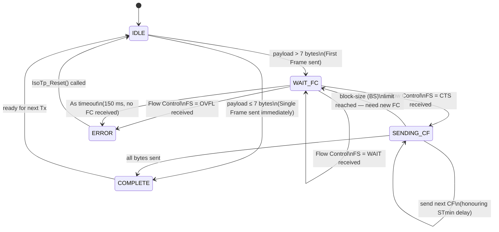
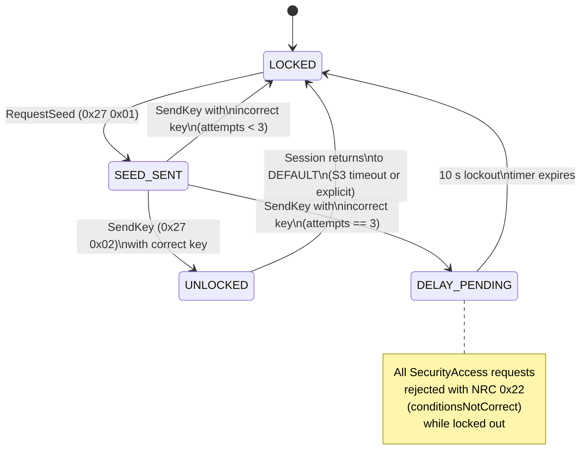

# State Machines

This document details the two core state machines in ECUS. Diagrams are
written in [Mermaid](https://mermaid.js.org/) syntax, which GitHub renders
natively in the web UI.

## 1. ISO-TP Rx Reassembly State Machine

Implemented in `src/transport/IsoTp.c`, driven by `IsoTp_ProcessRxFrame()`.
One instance per `IsoTpChannel`.



### Rx frame handling summary

| PCI byte (upper nibble) | Frame type | Handler | Effect |
|---|---|---|---|
| `0x0N` | Single Frame | `HandleSingleFrame` | Copies N bytes, delivers PDU immediately |
| `0x1N` | First Frame | `HandleFirstFrame` | Extracts 12-bit length, copies first 6 bytes, sends FC |
| `0x2N` | Consecutive Frame | `HandleConsecutiveFrame` | Validates SN, appends up to 7 bytes, checks completion |
| `0x3N` | Flow Control | `HandleFlowControl` | Consumed by the **Tx** state machine, not Rx |

## 2. ISO-TP Tx Segmentation State Machine

Driven by `IsoTp_Transmit()` (entry) and `IsoTp_TxPump()` (periodic, called
every tick from `UdsServer_Tick()`).



### Timing parameters honoured

| Parameter | Meaning | ECUS default |
|---|---|---|
| **BS** (Block Size) | Number of CFs to send before requiring a new FC | `0` (unlimited — receiver's choice) |
| **STmin** (Separation Time min) | Minimum delay between consecutive CFs | `0 ms` (as fast as possible) |
| **As** | Max time to complete a single Tx frame | `150 ms` |
| **Cr** | Max time to wait for the next CF while receiving | `150 ms` |

## 3. UDS Diagnostic Session State Machine

Implemented across `UdsServer.c` (state storage, S3 timer) and
`UdsDispatcher.c` (`Handle_DiagnosticSessionControl`, session-gated
dispatch via `CheckSessionAccess`).

```mermaid
stateDiagram-v2
    [*] --> DEFAULT

    DEFAULT --> PROGRAMMING: DiagnosticSessionControl(0x02)
    DEFAULT --> EXTENDED: DiagnosticSessionControl(0x03)

    PROGRAMMING --> DEFAULT: DiagnosticSessionControl(0x01)\nor S3 timeout\nor ECUReset
    PROGRAMMING --> EXTENDED: DiagnosticSessionControl(0x03)

    EXTENDED --> DEFAULT: DiagnosticSessionControl(0x01)\nor S3 timeout\nor ECUReset
    EXTENDED --> PROGRAMMING: DiagnosticSessionControl(0x02)

    note right of DEFAULT
        Security access is reset
        to LOCKED whenever this
        state is entered
    end note

    note right of EXTENDED
        S3 = 5000 ms.
        TesterPresent (0x3E) or
        any service request
        resets the S3 timer.
    end note
```

## 4. Security Access State Machine

Implemented in `Handle_SecurityAccess()` (`UdsDispatcher.c`) and
`UdsServer_Tick()` (lockout countdown).



### Key algorithm (demonstration only)

```
seed          = rand() ^ time(NULL)              // server-generated, 32-bit
key_expected  = (~seed) ^ 0xA5A5A5A5              // deterministic function
unlock        = (key_received == key_expected)
```

> **Note**: this XOR-based algorithm exists to exercise the *protocol
> mechanics* correctly (seed/key round-trip, attempt counting, lockout
> timing). Real automotive ECUs use manufacturer-specific, non-public
> cryptographic algorithms — the mechanics demonstrated here transfer
> directly regardless of which specific key-derivation function sits
> behind them.
