# System Architecture

This document expands on the layered architecture introduced in
[`../HLD.md`](../HLD.md), with module interaction diagrams and the
reasoning behind the layering choices.

## Module Interaction Diagram

```mermaid
graph TD
    subgraph Application
        Main[Main.c]
        CLI[ShellCli.c]
        Session[EcuSession.c]
    end

    subgraph UDS["UDS Stack (ISO 14229)"]
        Server[UdsServer.c]
        Dispatch[UdsDispatcher.c]
    end

    subgraph Transport["Transport (ISO 15765-2)"]
        IsoTp[IsoTp.c]
        Ring[RingBuffer.c]
    end

    subgraph HAL["Platform HAL"]
        CanHal[CanHal.c]
    end

    subgraph Services["Cross-cutting Services"]
        Log[Logger.c]
        Crc[CrcEngine.c]
        Err[ErrorHandler.c]
        Endian[EndianUtils.h]
        Pool[MemPool.c]
        Sig[SignalHandler.c]
    end

    Main --> Session
    Main --> CLI
    CLI --> Session
    CLI -.injects PDU via.-> CanHal

    Session --> Server
    Session --> CanHal

    Server --> Dispatch
    Server --> IsoTp

    Dispatch --> IsoTp
    IsoTp --> CanHal
    IsoTp --> Ring

    CanHal --> Ring

    Server -.-> Log
    Dispatch -.-> Log
    IsoTp -.-> Log
    CanHal -.-> Log
    Main -.-> Err
    Main -.-> Sig

    style Application fill:#3a3550,stroke:#AFA9EC
    style UDS fill:#2e4a45,stroke:#5DCAA5
    style Transport fill:#2a3f52,stroke:#85B7EB
    style HAL fill:#3a3a38,stroke:#B4B2A9
    style Services fill:#4a3f28,stroke:#FAC775
```



Solid arrows: structural dependency (compile-time `#include` +
function calls). Dashed arrows: cross-cutting service usage (logging,
error handling) — present in nearly every module but omitted where it
would clutter the diagram.

## Why a Composition Root (`EcuSession.c`)?

Every module below the Application layer is intentionally **unaware of
how it is wired to its neighbours**:

- `UdsServer.c` knows about `IsoTpChannel` (owns one), but has zero
  `#include` on `CanHal.h` — it never calls `CanHal_*` functions
  directly.
- `IsoTp.c` calls `CanHal_Transmit()` to send frames, but has no
  knowledge of *who* receives them or how the Rx path is wired.
- `CanHal.c` exposes a generic `CanRxCallbackFn` — it doesn't know it
  will be wired to a UDS server; it could equally be wired directly to
  a test harness (as the unit tests do).

`EcuSession.c` is the single place that performs the wiring:
`CanHal_RegisterRxCallback(OnCanFrameReceived, &s_server)`. This
"composition root" pattern (borrowed from dependency-injection
terminology, applied in plain C via function pointers) is what makes
each layer's unit tests possible — `tests/unit/test_UdsDispatcher.c`
performs its *own* wiring (`CanHal_RegisterRxCallback(OnFrame,
&s_server)`) independent of the production `EcuSession.c` wiring,
proving the modules are genuinely decoupled.

## Why a Virtual CAN HAL Instead of SocketCAN?

Three options were considered for the HAL:

| Option | Portability | Setup friction | Timing realism |
|---|---|---|---|
| SocketCAN (`vcan0`) | Linux-only | Requires `sudo modprobe vcan`, root to configure interface | High (real kernel scheduling) |
| Direct function calls (no HAL thread) | Fully portable | Zero | **None** — hides async bugs |
| **Virtual HAL + POSIX thread** (chosen) | Fully portable (any POSIX system) | Zero | High (real thread scheduling, real `nanosleep` cadence) |

SocketCAN would tie the entire project to Linux and require elevated
privileges just to `git clone && make && ./ecus` — a serious portfolio
liability for a project meant to be cloned and reviewed quickly. Direct
synchronous function calls (skip the HAL thread entirely) would be
portable but would erase the asynchronous, interrupt-driven timing
relationship that is the entire *point* of testing a transport-layer
state machine — race conditions between `IsoTp_TxPump()` and an
incoming Flow Control frame simply wouldn't exist to find.

The chosen design (a real POSIX thread simulating ISR behaviour,
looping Tx back to Rx) preserves the asynchronous programming model
without any external dependency — `git clone && make && ./ecus` just
works, on Linux or macOS, no `sudo`.

## Why a Dispatch Table for UDS Services?

Compare the two designs:

**Rejected: `switch` statement**
```c
switch (sid) {
    case UDS_SID_DIAGNOSTIC_SESSION_CONTROL:
        if (!SessionAllows(server, SESSION_ALL)) return NrcDeny();
        return Handle_DiagnosticSessionControl(...);
    case UDS_SID_ECU_RESET:
        if (!SessionAllows(server, SESSION_ALL)) return NrcDeny();
        return Handle_EcuReset(...);
    /* ... session-check logic duplicated in every case ... */
}
```

**Chosen: declarative table**
```c
static const ServiceEntry k_serviceTable[] = {
    { UDS_SID_DIAGNOSTIC_SESSION_CONTROL, Handle_DiagnosticSessionControl,
      UDS_SESSION_FLAG_ALL, false, "DiagnosticSessionControl" },
    { UDS_SID_ECU_RESET, Handle_EcuReset,
      UDS_SESSION_FLAG_DEFAULT | UDS_SESSION_FLAG_PROGRAMMING | UDS_SESSION_FLAG_EXTENDED,
      false, "ECUReset" },
    /* ... */
};
```

The table form has three concrete advantages that matter in production
UDS stacks (and are exactly what a reviewer familiar with, e.g., Vector
CANdelaStudio-generated code would recognise):

1. **Session/security policy is data, not code** — auditable at a glance,
   and a safety reviewer can verify the entire access-control matrix by
   reading one table instead of tracing through N functions.
2. **Adding a service is additive** — one new row, zero risk of breaking
   an existing `case` label's fallthrough or forgetting the session
   check in a new branch.
3. **The dispatcher itself never grows** — `UdsDispatcher_Dispatch()`'s
   logic is identical whether the table has 8 entries or 80.

## Why a Custom Memory Pool Instead of `malloc`?

MISRA-C:2012 Rule 21.3 disallows dynamic memory allocation
(`malloc`/`free`/`calloc`/`realloc`) in safety-related code, for three
well-established reasons:

1. **Non-determinism**: `malloc()`'s worst-case latency is unbounded
   (heap walking, `sbrk`/`mmap` syscalls) — unacceptable in a hard
   real-time diagnostic response window (UDS P2 timing is 25–50 ms).
2. **Fragmentation**: long-running ECU firmware (weeks/months of
   uptime) can fragment a general-purpose heap to the point of
   allocation failure even with nominally "enough" free memory.
3. **Certification cost**: proving a general-purpose allocator is free
   of use-after-free/double-free across all call paths is significantly
   harder than proving the same for a fixed-block pool with a bounded,
   enumerable set of allocation sites.

`MemPool` (see [`../LLD.md#16-mempool`](../LLD.md)) gives O(1),
fragmentation-free allocation from a static buffer — the same pattern
used in AUTOSAR `MemMap`-style memory partitioning on real ECUs.
